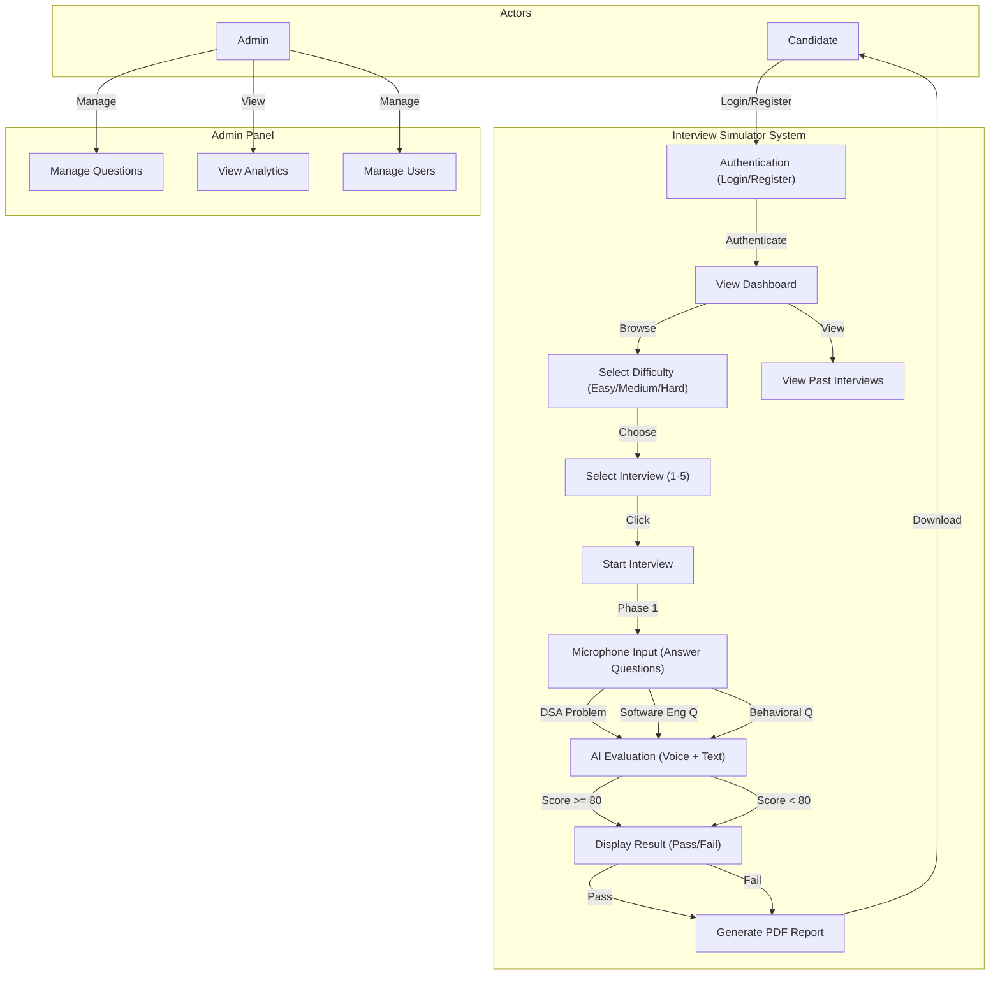
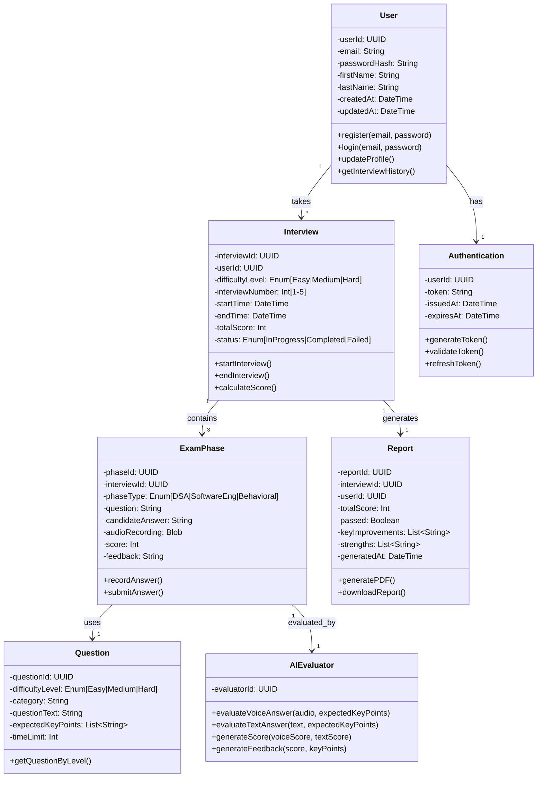
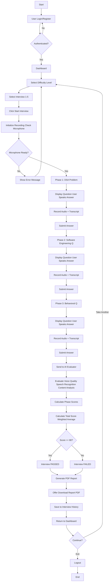

# AI Mock Interview Simulator

An AI-powered interview assessment platform that provides real-time audio-based interview practice with automated speech-to-text transcription, AI-powered answer evaluation, and comprehensive performance analytics.

## Project Information

**Architecture:** Microservices (Service-Oriented Architecture)

The application is built as a distributed system with clear separation between presentation layer (React frontend), application layer (Express backend), and data persistence layer (MongoDB). Frontend and backend services are independently deployable and scalable.

---

## Overview

The AI Mock Interview Simulator is a full-stack web application providing an interactive interview practice environment with the following capabilities:

- User account management with secure authentication
- Three difficulty levels: Easy, Medium, and Hard
- Five randomized interview questions per difficulty level
- Three-phase exam system:
  - Data Structures & Algorithms (35% weight)
  - Software Engineering (35% weight)
  - Behavioral Questions (30% weight)
- Real-time audio recording and automatic speech-to-text conversion
- AI-powered answer evaluation using large language models
- Automated pass/fail determination with 80-point threshold
- Personalized performance feedback and improvement recommendations
- PDF report generation with detailed interview analytics

---

## System Architecture

This microservices-based architecture separates concerns across three independent layers:

- **Frontend Service:** React-based Single Page Application (SPA) with TypeScript
- **Backend Service:** RESTful API microservice built with Express.js and Node.js
- **Data Persistence:** MongoDB document database with Mongoose ODM
- **External Services:** Groq LLM for evaluation, Hugging Face for transcription, Firebase for storage

Services communicate exclusively through REST APIs, enabling independent scaling and deployment.

### Use Case Diagram



### Class Diagram



### Activity Diagram



---

## Project Structure

### Directory Layout

```
interview-simulator/
├── frontend/                        React TypeScript Application
│   ├── src/
│   │   ├── pages/
│   │   │   ├── LoginPage.tsx
│   │   │   ├── DashboardPage.tsx
│   │   │   ├── InterviewPage.tsx
│   │   │   └── ResultsPage.tsx
│   │   ├── components/
│   │   │   ├── AudioRecorder.tsx
│   │   │   ├── ScoreDisplay.tsx
│   │   │   └── ReportDownload.tsx
│   │   ├── services/
│   │   │   ├── api.ts
│   │   │   └── audioService.ts
│   │   ├── store/
│   │   │   └── authStore.ts
│   │   ├── types/
│   │   │   └── app.types.ts
│   │   └── main.tsx
│   ├── vite.config.ts
│   └── package.json
│
├── backend/                         Node.js Express Application
│   ├── src/
│   │   ├── models/
│   │   │   ├── User.ts
│   │   │   ├── Interview.ts
│   │   │   └── ExamPhase.ts
│   │   ├── controllers/
│   │   │   ├── authController.ts
│   │   │   ├── interviewController.ts
│   │   │   └── evaluationController.ts
│   │   ├── services/
│   │   │   ├── authService.ts
│   │   │   ├── groqService.ts
│   │   │   ├── audioProcessingService.ts
│   │   │   └── reportService.ts
│   │   ├── routes/
│   │   │   └── index.ts
│   │   ├── middleware/
│   │   │   └── auth.ts
│   │   ├── app.ts
│   │   └── server.ts
│   ├── tests/
│   │   ├── auth.test.ts
│   │   ├── interview.test.ts
│   │   └── evaluation.test.ts
│   ├── Dockerfile
│   └── package.json
│
├── .github/workflows/
│   ├── frontend-ci.yml
│   ├── backend-ci.yml
│   └── deploy.yml
│
├── docker-compose.yml
└── README.md
```

---

## Key Features

### User Management
- User registration with email and password
- Secure authentication using JWT tokens and bcryptjs password hashing
- Profile management and interview history tracking
- Session management with token expiration

### Interview System
- Three difficulty levels: Easy, Medium, Hard
- Five randomized interviews per difficulty level
- Three-phase exam structure:
  - Phase 1: Data Structures & Algorithms (35% weight)
  - Phase 2: Software Engineering (35% weight)
  - Phase 3: Behavioral Questions (30% weight)
- Each interview question has a time limit and expected key points

### Audio Recording & Processing
- Real-time audio recording using RecordRTC and Web Audio API
- Automatic speech-to-text transcription using Hugging Face Whisper API
- Audio quality analysis and feedback
- Secure audio file storage in Firebase

### AI-Powered Evaluation
- Answer evaluation using Groq API (Mixtral 8x7B model)
- Scoring based on content accuracy and completeness
- Detection of missing key concepts
- Comparison against expected answers
- Weighted scoring across all three phases

### Performance Analytics
- Total score calculation with pass/fail determination (80 points threshold)
- Per-phase scoring and feedback
- Identification of strengths and areas for improvement
- Personalized recommendations for skill development

### Report Generation
- Automated PDF report generation using html2pdf and jsPDF
- Comprehensive feedback including:
  - Overall score and pass/fail status
  - Per-phase breakdown
  - Key strengths highlighted
  - Specific areas for improvement
  - Actionable recommendations
- PDF download and local storage

---

## Technology Stack

### Frontend
- React 18 with TypeScript for type-safe UI development
- Vite for ultra-fast build and development experience
- Tailwind CSS for responsive styling
- Zustand for lightweight state management
- Axios for HTTP client
- RecordRTC for audio recording
- html2pdf and jsPDF for PDF generation
- Vitest and React Testing Library for unit tests
- Cypress for end-to-end testing

### Backend
- Node.js 18 LTS runtime
- Express framework for REST API
- TypeScript for type safety
- MongoDB with Mongoose ODM for data persistence
- JWT for authentication
- bcryptjs for password hashing
- Groq API for AI-powered answer evaluation
- Hugging Face for speech-to-text transcription
- Firebase Admin SDK for file storage
- Jest and Supertest for testing

### Infrastructure & Deployment
- MongoDB Atlas M0 free tier for database
- Firebase Storage for file management
- GitHub Actions for continuous integration and testing
- Vercel for frontend deployment
- Railway for backend deployment

---


### Continuous Integration
GitHub Actions automates test execution on every pull request:
- Backend test suite (Jest with coverage reporting)
- Frontend test suite (Vitest with coverage reporting)
- E2E test suite (Cypress headless mode)
- Build process validation
- Deployment readiness checks

---

## Cost Analysis

The entire application operates on free tier services:

- **Vercel:** Serverless frontend deployment, automatic HTTPS, GitHub integration
- **Railway:** Backend runtime with generous free tier allocation
- **MongoDB Atlas:** M0 free tier (512MB, 100 concurrent connections)
- **Groq API:** Free tier (30 requests/minute, Mixtral 8x7B model)
- **Hugging Face:** Free API access with rate limiting
- **Firebase Storage:** 5GB/month free tier for audio file storage
- **GitHub:** Unlimited repositories with Actions for CI/CD

**Total Monthly Cost:** $0

---

## License

This project is provided as-is for portfolio and demonstration purposes.

---

## Support

For issues, questions, or feedback, please open an issue in the repository.

---

## Acknowledgments

This project demonstrates production-grade full-stack development utilizing:
- Groq API for efficient and cost-free LLM inference
- Hugging Face Transformers for automatic speech recognition
- MongoDB Atlas for scalable document storage
- Modern React and Express frameworks for reliable application layers
